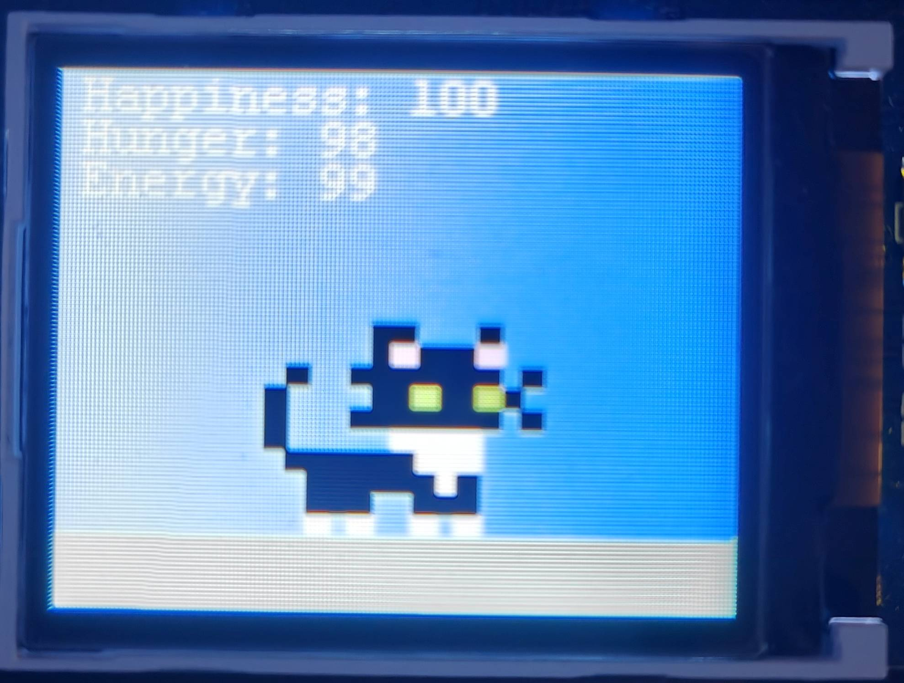
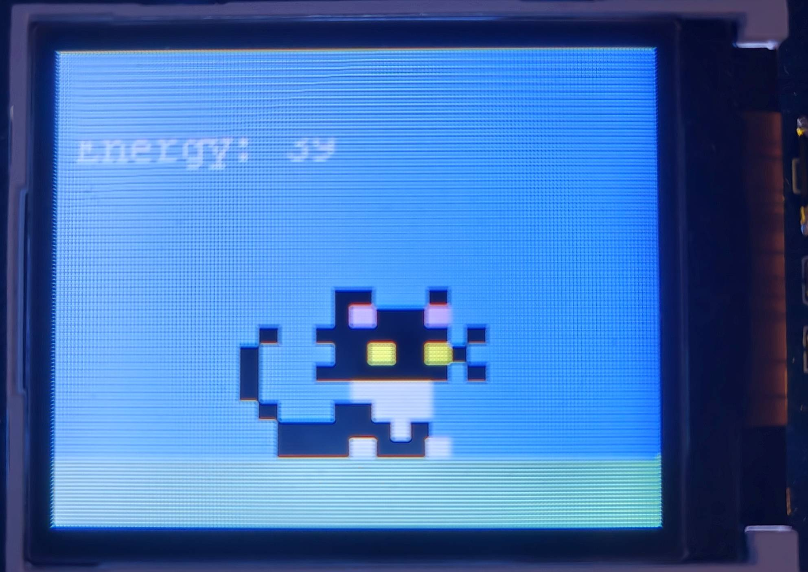
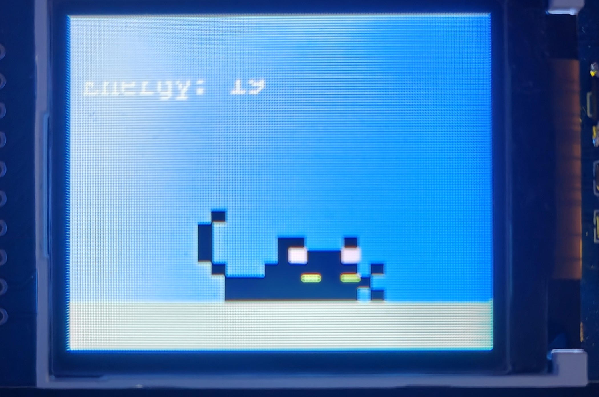

# ByteCat
A [Tamagotchi](https://en.wikipedia.org/wiki/Tamagotchi)-like game designed for the BBC Microbit where you take care of your very own virtual cat!

## Gameplay
By pressing the two Microbit buttons or shaking the device, you can feed, pet or play with ByteCat!

Happiness, hunger, and energy each dynamically affect one another and update over time, so keeping a well maintained-balance is essential!

If ByteCat's energy is too low, it will need a good rest.

## Technical
ByteCat was developed entirely within [Microsoft MakeCode](https://makecode.microbit.org/)'s code editor using Python.

### How to run
1. Download the [ByteCat.py](https://github.com/RedNate22/ByteCat/blob/main/ByteCat.py) file
2. Open this file within MakeCode
3. Press 'Download' to download the .hex version
4. Transfer the hex file to your connected BBC Microbit

### Microbit Integration
The BBC Microbit's built-in LEDs showcase what ByteCat is thinking!

### Waveshare TFT Screen
ByteCat is displayed in all of it's pixelated glory using the [Waveshare 1.8inch TFT Screen](https://smalldevices.com.au/products/waveshare-1-8inch-160x128-tft-colour-display-for-the-bbc-micro-bit?variant=12582303334423) for the Microbit.

[Documentation](https://github.com/waveshare/WSLCD1in8)

### Technical Limitations 
Due to the technical limitations of the Waveshare TFT Screen, the screen can take a significantly long time (30-60 seconds) to refresh each frame. To combat this, my intent was to use the Microbit's LEDs to give faster real-time updates of ByteCat's moods and statuses. This also proposed a challenge on how often ByteCat's statuses should update, as faster real-time updates meant a constant refreshing of the screen, resulting in glitchy or slow gameplay.

Furthermore, the memory constraints of the BBC Microbit itself also placed constraints on the project scope.
